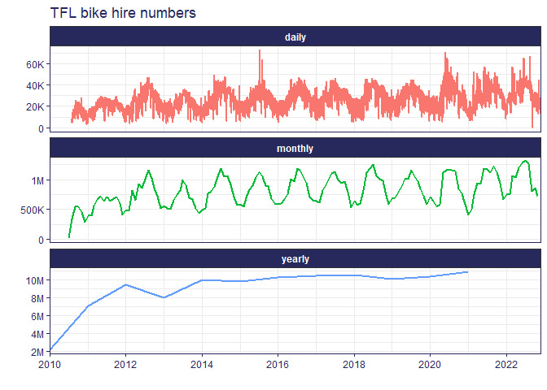

TFL cycle hire analysis
================

This repository contains a quick analysis of daily hires from the TFL
cycle hire scheme, as a way for me to learn a bit more about time series
analysis.

I downloaded the cycle hire data from the [London
Datastore](https://data.london.gov.uk/dataset/number-bicycle-hires) and
analysed it alongside some info on the number of docking stations from
the [TFL
API](https://api.tfl.gov.uk/swagger/ui/index.html?url=/swagger/docs/v1#!/BikePoint/BikePoint_GetAll)
and [a time series of COVID restrictions in
London](https://data.london.gov.uk/dataset/covid-19-restrictions-timeseries).

